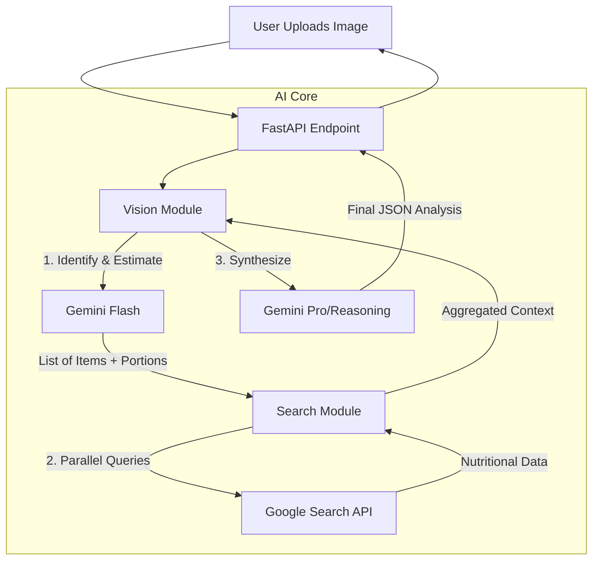

# Food Agent Server 🍎🤖

**Enterprise-Grade AI Food Analysis System**

A high-performance, asynchronous FastAPI backend that leverages cutting-edge Multimodal LLMs (Gemini 3/2.5) and Real-Time Web Search (SerpAPI) to provide accurate, scientifically grounded nutritional assessments from food images.

## 🚀 Key Features

### 🧠 Advanced AI Intelligence
- **Model Fallback Strategy**: Automatically iterates through a prioritized list of models (`Gemini 3 Pro` -> `2.5 Pro` -> `2.5 Flash`) to ensure maximum reliability and uptime.
- **Chain-of-Thought Vision**: Uses a "Dietitian Persona" prompt with 5-step spatial reasoning (Scene Analysis -> Segmentation -> Volumetric Estimation -> Weight Conversion -> Calculation).
- **Hallucination Reduction**: Grounds all nutritional data in real-time search results rather than relying solely on LLM training data.

### ⚡ Performance & Efficiency
- **Parallel Processing**: Uses `asyncio` to perform web searches for multiple food items simultaneously, drastically reducing latency.
- **Smart Caching**: Implements LRU (Least Recently Used) caching for search queries to minimize API costs and response time.
- **RAM Optimization**: Automatically resizes high-resolution images to efficient dimensions (1024px) before processing to prevent memory overflows.

### 🛠 Enterprise Architecture
- **SerpAPI Integration**: "Identify-Search-Synthesize" workflow for verified data.
- **Robust Logging**: Detailed structured logs via `loguru` for debugging and audit trails.
- **Async I/O**: Fully non-blocking network calls using `httpx`.

---

## 🏗 Architecture



## 📋 Prerequisites

- Python 3.9+
- **Google AI Studio API Key** (for Gemini models)
- **SerpAPI Key** (for Google Search data)

## ⚙️ Installation

1.  **Clone the repository**
2.  **Create a virtual environment** (recommended)
    ```bash
    python -m venv venv
    # Windows
    .\venv\Scripts\activate
    # Mac/Linux
    source venv/bin/activate
    ```
3.  **Install Dependencies**
    ```bash
    pip install -r requirements.txt
    ```

## 🔐 Configuration

Create a `.env` file in the root directory:

```ini
# Required Keys
GOOGLE_API_KEY=your_gemini_api_key_here
SERPAPI_API_KEY=your_serpapi_key_here

# Optional Settings
LOG_LEVEL=INFO
```

## 🏃‍♂️ Usage

### Start the Server
Run the application using Uvicorn (uses `main.py` entry point):

```bash
uvicorn main:app --reload
```
*Server will start at `http://127.0.0.1:8000`*

### API Endpoints

#### `POST /api/v1/food/analyze`
Analyzes an uploaded image.

**Request:**
- `Content-Type`: `multipart/form-data`
- `file`: (Binary Image file)

**Response (JSON):**
```json
{
  "overall_description": "A balanced meal featuring grilled salmon...",
  "items": [
    {
      "name": "Grilled Salmon",
      "estimated_portion": "6 oz",
      "nutrition": {
        "calories": "350 kcal",
        "protein": "38g",
        "carbs": "0g",
        "fats": "20g"
      },
      "search_insights": { "source": "USDA data via SerpAPI" }
    }
  ],
  "total_calories_estimate": "550 kcal",
  "health_score": 9,
  "dietary_warnings": ["Fish allergen"]
}
```

## 📂 Project Structure

```
food_agent_server/
├── app/
│   ├── core/
│   │   ├── intelligence.py # LLM Client & Fallback Logic
│   │   ├── search.py       # Async SerpAPI Client with Caching
│   │   └── vision.py       # Main Analysis Pipeline (Vision+Search)
│   ├── routers/
│   │   └── food.py         # API Route definitions
│   ├── config.py           # Configuration & Model Lists
│   ├── schemas.py          # Pydantic Data Models
│   └── dependencies.py     # DI (if needed)
├── main.py                 # App Entry Point
├── requirements.txt        # Python Packages
└── .env                    # Secrets
```

## 🛡 Disclaimer
This tool provides **estimates** based on visual analysis and search data. It is for informational purposes only and should not replace professional medical advice.
